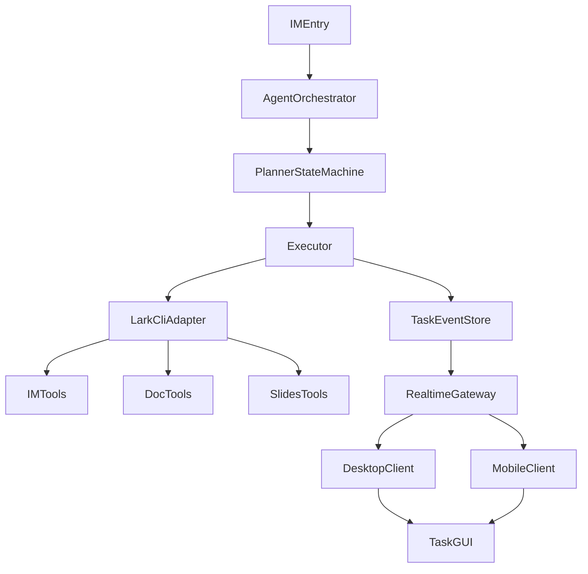
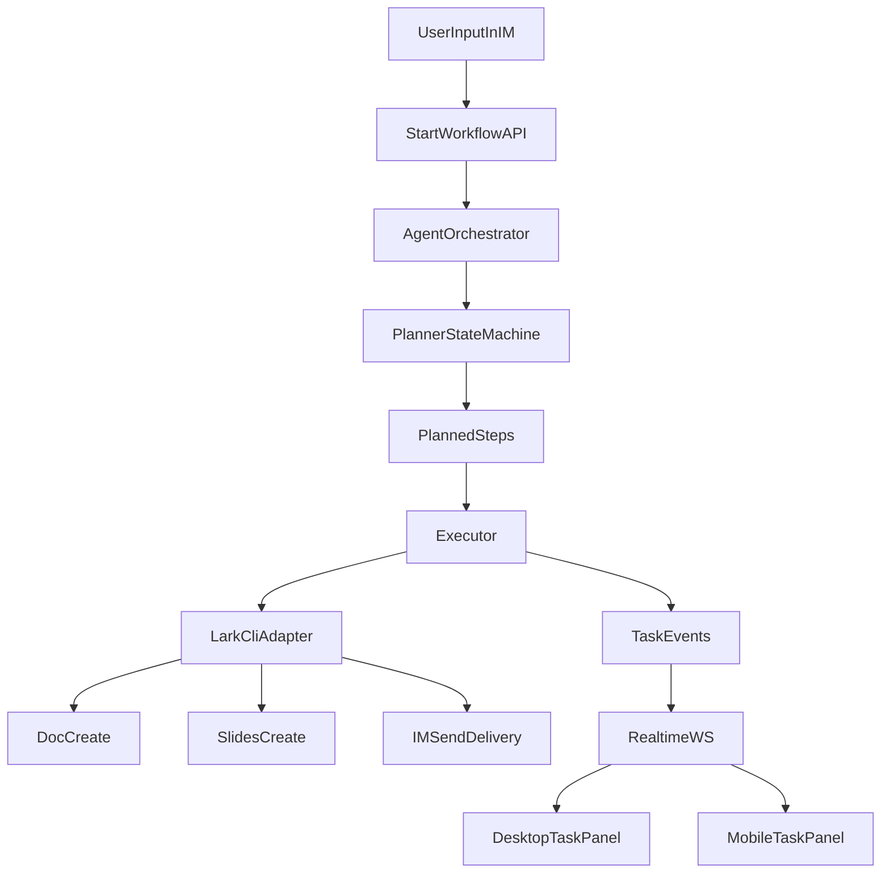

# 飞书 IM 需求驱动 Agent 系统架构说明（CLI 融合版）

> 用途：结合命题要求与当前项目现状，定义以 `lark-cli` 为核心工具层的可落地架构。该文档聚焦架构与契约，不包含实现代码。

## 0. 架构目标

### 0.1 业务目标
- 把“IM 对话 -> 结构化文档 -> 演示稿 -> 回 IM 交付”串成 Agent 可编排、可观测、可中断的闭环。
- 保持“Agent 主驾驶、GUI 仪表盘”定位，避免前端承载主流程编排。
- 在现有工程基础上演进，优先保证比赛演示闭环。

### 0.2 关键原则
- Agent First：核心决策和步骤编排都在后端 Orchestrator。
- Tool Unification：所有飞书能力统一走 `lark-cli` 适配层。
- Event Driven：多端一致以任务事件流为主，不依赖页面本地状态推断。
- Safe by Default：写操作默认 dry-run，可配置确认闸门。

## 1. 分层架构（CLI 深度融合）

### 1.1 总览图

### 1.2 前端层（Desktop / Mobile）

1. `IM Client`
   - 支持自然语言输入、进度查询、确认节点反馈。
   - 发起 `workflow/start`，订阅 `task:{taskId}` 事件。

2. `Task GUI`
   - 展示状态机阶段：`detecting -> intent -> planning -> executing -> completed -> reflecting`。
   - 展示步骤日志、错误、产物链接、确认请求。

3. `Doc/PPT Viewer`
   - 以“产物链接 + 结构预览”为主，编辑态同步沿用现有 blocks 能力。
   - 不直接调飞书 API，不在前端做流程编排。

### 1.3 后端层（Agent Service + Realtime）

1. `AgentOrchestrator`
   - 任务生命周期控制、步骤调度、确认点管理。
   - 对接 Planner、Executor、Memory、RiskGuard。

2. `PlannerStateMachine`
   - 输出结构化步骤计划，支持 `docOnly / docAndSlides / deliveryOnly` 路径。
   - 低置信度意图触发澄清步骤（加分项预留）。

3. `Executor`
   - 逐步执行并写入任务事件。
   - 统一通过 `LarkCliAdapter` 调飞书能力。

4. `LarkCliAdapter`
   - 输入：`ToolCall`（tool, identity, args, dryRun, riskLevel）。
   - 输出：`ToolResult`（ok, data, error, raw, latencyMs）。
   - 内置 CLI 版本能力探测、参数兼容、错误归一化。

5. `RealtimeGateway`
   - 推送任务事件到多端。
   - 保留现有 blocks/tasks 同步能力，新增 task channel。

### 1.4 数据层

1. `TaskEventStore`
   - 保存任务状态迁移、步骤执行、错误与确认日志。

2. `ArtifactStore`
   - 保存 Doc/Slides 链接、版本、导出信息。

3. `EvidenceStore`
   - 保存意图判断证据、抽取片段、回溯信息。

4. `MemoryStore`
   - 保存用户偏好、模板、反思结果，服务后续任务。

## 2. 核心模块定义（CLI 对齐）

### 2.1 IM 入口模块
- 输入：群聊/单聊文本指令、上下文范围、触发来源。
- 输出：`workflow/start` 请求 + 会话上下文快照。

### 2.2 Planner 模块
- 输入：意图解析结果、上下文摘要、风险策略。
- 输出：步骤链，例如：
  - `ExtractIntent`
  - `GenerateDoc`
  - `GenerateSlides`
  - `SendDeliveryMessage`

### 2.3 LarkCliAdapter 模块

- IMTools（推荐首批）
  - `im +chat-search`
  - `im +messages-send`
  - `im +messages-list`

- DocTools（推荐首批）
  - `docs +create`
  - `docs +update`
  - `docs +read`

- SlidesTools（第二阶段）
  - `slides` 相关创建/更新命令，或先走“预览 + 链接回传”过渡。

### 2.4 Realtime TaskEventBus 模块
- 事件主题：
  - `task.state`
  - `task.step`
  - `task.artifact`
  - `task.confirm_required`
  - `task.error`
- 订阅粒度：`task:{taskId}`、`conversation:{conversationId}`。

## 3. 端到端数据流（A-F 场景映射）

### 3.1 主链路

### 3.2 与命题场景映射
- 场景 A（IM 入口）：`IM Client + workflow/start`。
- 场景 B（任务规划）：`PlannerStateMachine`。
- 场景 C（文档生成）：`DocTools + blocks 预览/编辑`。
- 场景 D（演示稿生成）：`SlidesTools` 或过渡方案。
- 场景 E（多端一致）：`TaskEventBus + 现有实时同步`。
- 场景 F（总结交付）：`im +messages-send` 回传产物链接。

## 4. 技术选型与约束

### 4.1 为什么以 CLI 为核心工具层
- 与比赛“第三方平台集成”高度匹配。
- 能快速覆盖 IM/Doc/Slides，减少 SDK 直接耦合。
- 便于做 dry-run、能力探测和参数兼容。

### 4.2 关键约束
- CLI 版本差异：必须做命令能力探测缓存（例如是否支持 `--format`）。
- 身份差异：`user` 与 `bot` 权限模型不同，需在任务启动时 preflight。
- 群策略限制：外部群与跨租户场景默认不作为首轮验收路径。

## 5. 风险控制

- 权限风险：任务开始前执行 scope 预检，不满足则进入澄清/引导授权步骤。
- 误操作风险：高风险写操作默认 `dryRun=true`，需要显式确认后再执行。
- 兼容性风险：对 CLI 错误做标准化映射，前端只消费统一错误码。
- 可观测性风险：每一步都写入 `TaskEventStore`，保证演示与回放一致。

## 6. 与当前代码库的对齐建议

- `agent-service`
  - 升级为 `Orchestrator + Planner + Executor + LarkCliAdapter`。
  - 复用已有 CLI Runner 与命令构建器，补能力探测和错误归一化。

- `realtime-server`
  - 在现有 tasks/blocks 事件外新增 `task:{taskId}` 事件分发通道。

- `frontend`
  - 任务面板改为消费后端任务事件，不再本地模拟完整任务流程。

> 详细接口契约、Phase 1 改造拆解和演示脚本见配套文档。

